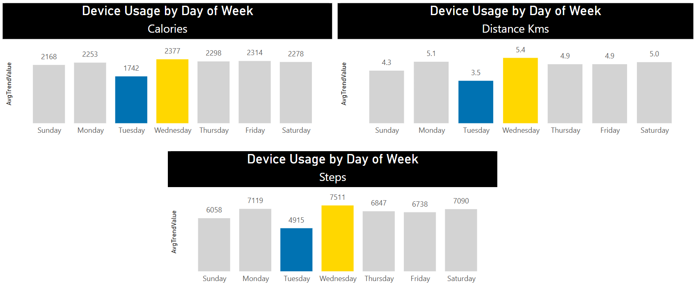
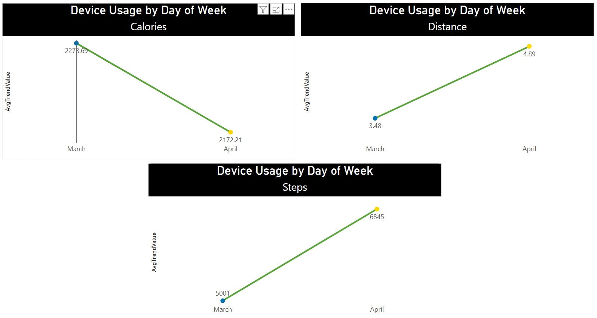

# Visualizations & Key Findings

This section presents the key visualizations developed in Power BI, along with concise interpretations that support the main findings from the analysis.

---

## 1. Weekly Seasonality in Device Usage

**Interpretation:**  
Device usage peaks on Wednesdays (2.4K), with strong engagement also on Mondays, Thursdays, Fridays, and Saturdays (all around 2.3K). The lowest activity is observed on Tuesdays (1.7K). This pattern suggests that mid-week and weekends are optimal periods for user engagement or promotional campaigns.

---

## 2. Monthly Usage Trends

**Interpretation:**  
The charts above illustrate how key activity metrics—Calories, Distance, and Steps—changed from March to April:

- **Calories:** Average calories burned per user slightly decreased from 2,278.69 in March to 2,172.21 in April. This could indicate a shift in activity intensity or types of exercise.
- **Distance:** There was a notable increase in the average distance covered, rising from 3.48 to 4.89. This suggests users engaged in longer or more frequent sessions.
- **Steps:** The average daily step count jumped significantly from 5,001 in March to 6,845 in April, indicating a substantial boost in walking or running activity.

**Summary:**  
While calorie expenditure saw a modest dip, both distance and step count increased markedly, pointing to more frequent or longer duration activities (possibly at lower intensity) in April. This seasonal trend can inform Bellabeat’s engagement strategy, such as promoting challenges or campaigns that capitalize on increased springtime activity.
---

## 3. User Activity Distribution

**Interpretation:**  
The distribution of average user activity shows a clear segmentation between highly active and less active users, suggesting the potential for targeted engagement strategies for each group.

---

## 4. Activity by Time of Day

**Interpretation:**  
Afternoon and night hours account for the highest levels of user activity (steps and calories burned), while mornings are less active. This insight can inform the timing of in-app notifications or feature releases.

---

## 5. Steps and Sleep Over Time

**Interpretation:**  
Daily variations in steps and sleep reveal patterns and possible correlations between physical activity and rest. Highlighting these trends to users could encourage healthy habits.

---

## 6. User Segmentation

**Interpretation:**  
The user base is split between "Active" and "Inactive" segments. This visual reinforces the need for differentiated marketing and retention approaches for each cohort.

---

### Note

All visualizations were created in Power BI, leveraging data prepared and cleaned as documented in the project. For further details or raw exports, refer to the `/visualizations` folder.

---
